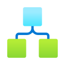
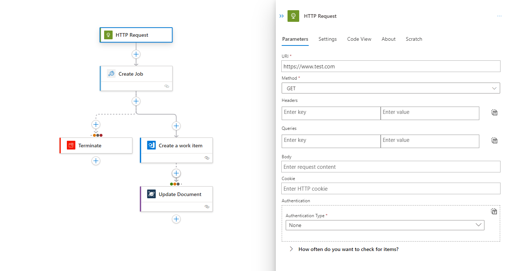

  
  
    Azure LogicAppsUX
  

# Overview

Azure Logic Apps is a cloud platform where you can create and run automated workflows with little to no code. By using the visual designer and selecting from prebuilt operations, you can quickly build a workflow that integrates and manages your apps, data, services, and systems.

This repository contains our UX focused Logic Apps projects like our new Logic Apps Workflow Designer, as well as our new Data Mapper project.

# Documentation

Full logic apps documentation is [available here](https://learn.microsoft.com/en-us/azure/logic-apps/)

A more in-depth overview is [available here](https://learn.microsoft.com/en-us/azure/logic-apps/logic-apps-overview)

 

# **New Logic Apps Designer**

Lots of text describing the app.

React, Fluent, react-flow, etc.

 

# **Data Mapper**

> Coming eventually ...?

 

---

## Contributing

This project welcomes contributions and suggestions. Most contributions require you to agree to a
Contributor License Agreement (CLA) declaring that you have the right to, and actually do, grant us
the rights to use your contribution. For details, visit https://cla.opensource.microsoft.com.

When you submit a pull request, a CLA bot will automatically determine whether you need to provide
a CLA and decorate the PR appropriately (e.g., status check, comment). Simply follow the instructions
provided by the bot. You will only need to do this once across all repos using our CLA.

This project has adopted the [Microsoft Open Source Code of Conduct](https://opensource.microsoft.com/codeofconduct/).
For more information see the [Code of Conduct FAQ](https://opensource.microsoft.com/codeofconduct/faq/) or
contact [opencode@microsoft.com](mailto:opencode@microsoft.com) with any additional questions or comments.

## Trademarks

This project may contain trademarks or logos for projects, products, or services. Authorized use of Microsoft
trademarks or logos is subject to and must follow
[Microsoft's Trademark & Brand Guidelines](https://www.microsoft.com/en-us/legal/intellectualproperty/trademarks/usage/general).
Use of Microsoft trademarks or logos in modified versions of this project must not cause confusion or imply Microsoft sponsorship.
Any use of third-party trademarks or logos are subject to those third-party's policies.
